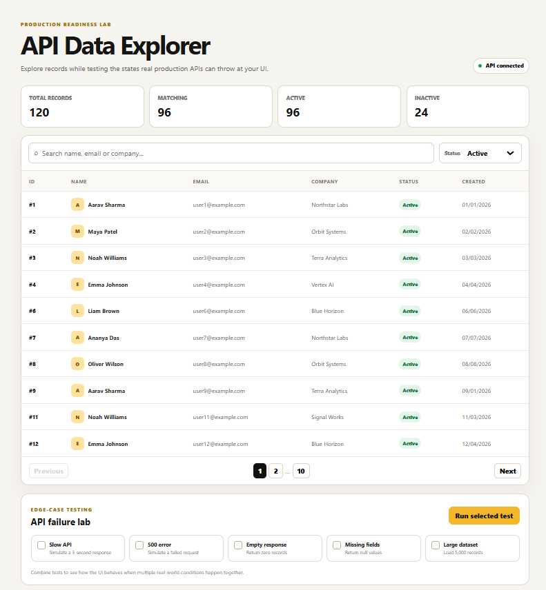
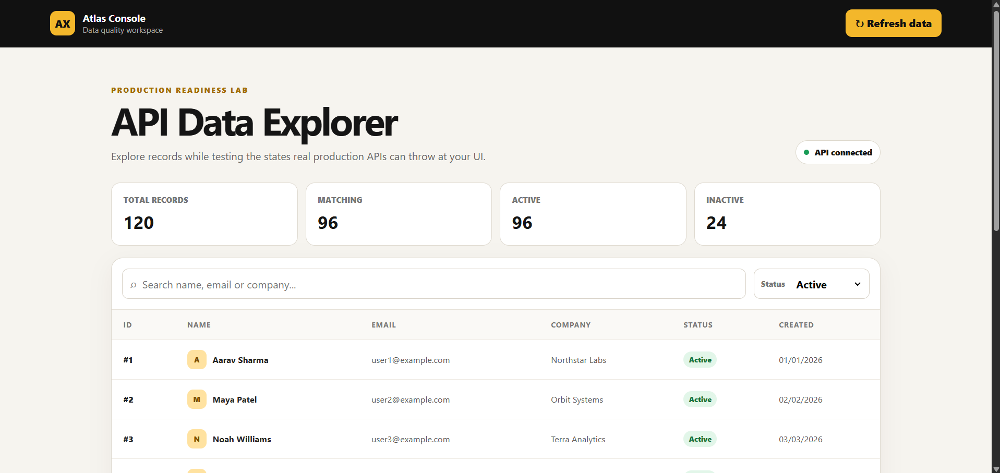
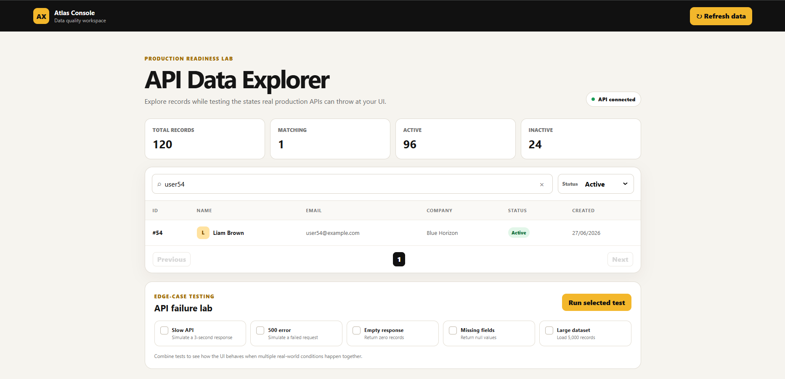

# API Data Explorer

Production-readiness focused React/Vite project with reusable components.

Features:
- API abstraction
- Loading, error and empty states
- Retry and refresh
- Search and filtering
- Pagination
- Safe handling of missing fields
- Slow API simulation
- 500 error simulation
- Empty response simulation
- Missing-field simulation
- 5,000-record dataset simulation
- Responsive table

Run:
npm install
npm run dev

Build:
npm run build seventy
